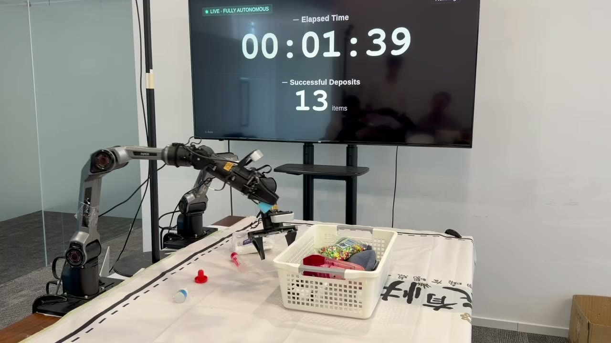

# Focus-VLWA

[English](README.md) | 简体中文

Focus-VLWA 面向双臂机器人操作，在统一模型中联合建模视觉历史、未来世界状态和机器人动作。

本开源版本聚焦最基本且可复现的能力：

- 后训练；
- 本地与服务化推理；
- 数据集及完整头部历史处理；
- 检查点保存、加载和数值验证。

仓库不包含预训练流水线及与上述能力无关的实验代码。

## 演示视频

[](https://cdn.jsdelivr.net/gh/MachEmbodied/Focus-VLWA@870aa92/docs/media/focus-vlwa-demo-web.mp4)

点击预览图观看完整演示视频（约 6 分钟）。

## 模型架构

实现围绕四个项目核心模块组织。

### 世界模型专家

世界模型专家是一个独立参数的 18 层 Transformer。它联合预测一个事件动作和 270 个未来状态令牌，并可通过事件动作监督与未来状态监督进行后训练。

### 联合专家注意力

视觉语言主干、动作专家和世界模型专家分别保留独立参数，但在同一次注意力计算中交互。动作令牌和世界状态令牌可以双向交换信息；视觉语言前缀不能读取动作及世界模型后缀。

### 联合流匹配

动作和世界状态在相同的时间步上通过 Euler 积分联合去噪。动作专家输出 50 步动作，世界模型专家输出事件动作和未来状态。

### 完整头部历史编码器

当前两阶段训练使用 `head_history`：输入过去20帧头部相机完整图像，每帧为224×224。按25 FPS回合时间格，每25个控制步采样一帧，取最近20个已完成时间格；不足20帧时补零并用掩码屏蔽，当前帧不进入自身历史。当前头部图像与历史图像按样本共享增强。

每帧历史图像池化为4×4网格，共16个令牌，20帧产生320个历史令牌。当前头部和双腕三个视角各保留256个令牌，共768个当前视觉令牌；因此视觉前缀合计1088个令牌，之后再接文本令牌。

## 源码结构

```text
src/focus_vlwa/
  model/          # 头部历史、世界专家、联合注意力和联合流匹配
  configs/        # 模型及后训练配置
  data/           # LeRobot 数据、归一化和完整头部历史
  inference/      # 分词器和本地推理策略
  post_training/  # PyTorch/DDP 后训练与检查点保存
  scripts/        # 命令行入口实现
tests/                            # 回归测试
```

公共 Python 包名为 `focus_vlwa`，安装包及命令名为 `focus-vlwa`，当前版本为 `1.0.0`。

## 安装

建议使用独立运行环境，避免影响其他模型或已有 Transformers 安装。

```bash
uv sync --extra train
uv run focus-vlwa install-transformers-patch
uv run focus-vlwa check-checkpoint /path/to/checkpoint
```

Transformers 补丁会安装到当前独立环境中的 `transformers==4.53.2`。

## 模型配置

模型统一使用20帧完整头部历史 `head_history`，文本长度为400，内部动作维度为32，动作预测长度为50步。检查点通过 `model_config.json` 恢复配置；加载器会把发布的 Focus-VLWA 权重参数名映射到重构后的模块，`check-checkpoint` 使用相同映射逐项检查张量形状。

## Focus-VLWA 权重发布文件

推理发布包只需要以下文件：

```text
focus-vlwa/
  model.safetensors
  model_config.json
  assets/arx_x5_sim/norm_stats.json
```

原训练目录中的 `metadata.pt` 和 `optimizer.pt` 是训练产物，不需要随推理权重发布。把 `model_config.json` 与权重放在同一目录，推理时便无需反序列化训练元数据。PaliGemma 分词器单独获取：离线运行时传入 `tokenizer_path`，联网运行时可由包下载并缓存。创建 `FocusVLWAPolicy` 时设置 `asset_id="arx_x5_sim"`。

评测前检查发布目录：

```bash
uv run focus-vlwa check-checkpoint /path/to/focus-vlwa
```

## 本地推理

```python
from focus_vlwa.inference import FocusVLWAPolicy

policy = FocusVLWAPolicy(
    "/path/to/checkpoint",
    tokenizer_path="/path/to/tokenizer.model",
    device="cuda",
)

prediction = policy.infer(
    {
        "state": joint_state,
        "images": {
            "cam_high": head_rgb,
            "cam_left_wrist": left_rgb,
            "cam_right_wrist": right_rgb,
        },
        "prompt": "stack the bowls",
        "hist_images": history_images,
        "hist_mask": history_mask,
    }
)

actions = prediction["actions"]
event_action = prediction["event_action"]
world_state = prediction["world_state"]
```

上述 `head_history` 示例的主要输入和输出形状如下：


| 字段           | 形状             | 说明                               |
| -------------- | ---------------- | ---------------------------------- |
| `state`        | `[14]`           | 当前机器人关节状态                 |
| 每路当前图像   | `[H,W,3]`        | RGB、`uint8`                       |
| `hist_images`  | `[20,224,224,3]` | 20帧头部历史完整图像，RGB、`uint8` |
| `hist_mask`    | `[20]`           | 有效帧为1，补零位置为0             |
| `actions`      | `[50,14]`        | 还原后的绝对关节目标               |
| `event_action` | `[1,32]`         | 世界模型事件动作                   |
| `world_state`  | `[270,32]`       | 未来世界状态令牌                   |

为了进行确定性对照，可以显式传入三组噪声：

- `noise`：`[1,50,32]`；
- `event_noise`：`[1,1,32]`；
- `world_noise`：`[1,270,32]`。

`head_history` 不传入 `hist_cells`，历史只包含头部图像，当前观测仍包含头部和双腕三路图像。使用 `HeadHistoryBuffer` 生成历史输入：每个控制步调用一次 `observe`，包括两次推理之间的控制步；每个新回合调用 `reset`。回合开始时不足的历史会补零并由掩码屏蔽。

历史缓存用法如下：

```python
from focus_vlwa.data.head_history import HeadHistoryBuffer
from focus_vlwa.inference import FocusVLWAPolicy

policy = FocusVLWAPolicy(
    "checkpoints/frozen/SELECTED_CHECKPOINT",
    asset_id="arx_x5_sim",
)
history = HeadHistoryBuffer()
# Call observe once per consecutive control step, including steps between replans.
history.observe(0, observation["images"]["cam_high"])
observation.update(history.pack(0))
result = policy.infer(observation)
# Call history.reset() at every new episode.
```

XPolicyLab 仓库 `policy/FocusVLWA` 中的适配器会逐控制步收集完整头部历史，并为每个环境维护独立缓存。

## 后训练

后训练分为两个阶段：`joint` 联合训练动作专家和世界模型专家；`frozen` 加载选定的联合阶段检查点并冻结世界模型专家。两个阶段都使用20帧完整头部历史，并在阶段开始时创建新的优化器。

### 数据与环境

安装 `.[train]` 使用 LeRobot v3；v2 数据集需在独立环境安装 `.[train-v2]`。v3 安装项使用 NumPy 2.2.6，v2 安装项使用 NumPy 1.26.4，不要混装两种读取器。训练环境中需安装仓库提供的 Transformers 补丁。

读取器支持原生动作序列或预先计算的50步动作段。数据需包含对齐的 `s1`、`s1_mask`、`event_action`、`event_action_mask`，冻结阶段也需要这些世界模型输入。头部历史从原始25 FPS回合图像中查询，世界模型潜在状态不进行分位数归一化。可通过 `FOCUS_VLWA_LEROBOT_REPOS` 覆盖数据分片选择。

初始化检查点必须包含 `model_config.json` 和归一化资产。分词器单独存放时，通过 `--tokenizer-path` 指定。

### 联合阶段与冻结阶段

```bash
focus-vlwa post-train \
  --stage joint --dataset data/lerobot \
  --init-checkpoint checkpoints/posttrain_init \
  --norm-stats-dir checkpoints/posttrain_init/assets/arx_x5_sim \
  --output-dir checkpoints/joint --batch-size 288

focus-vlwa post-train \
  --stage frozen --dataset data/lerobot \
  --init-checkpoint checkpoints/joint/SELECTED_CHECKPOINT \
  --norm-stats-dir checkpoints/joint/SELECTED_CHECKPOINT/assets/arx_x5_sim \
  --output-dir checkpoints/frozen --batch-size 288
```

将 `SELECTED_CHECKPOINT` 替换为要加载的联合阶段检查点目录名。


| 设置                      | 联合阶段       | 冻结 WM 阶段   |
| ------------------------- | -------------- | -------------- |
| 预热步数                  | 200            | 200            |
| 默认训练步数              | 5000           | 10000          |
| 峰值／最终学习率          | 2.5e-5／2.5e-6 | 2.5e-5／2.5e-6 |
| 余弦衰减终点              | 30000          | 10000          |
| WM 总损失／事件／状态权重 | 1／1／0.3      | 0／1／0.3      |

联合阶段的余弦衰减周期为30000步，因此在5000步结束时尚未达到最终学习率。通过 `--decay-steps` 修改衰减周期，世界模型的各项损失权重也可独立配置。

冻结阶段冻结世界模型专家及其输入、输出投影参数，保留注意力交互和输入梯度，跳过无用的世界模型监督输出。已有世界模型权重默认保留；显式指定 `--init-world-model-from-action` 时，从动作专家复制初始化世界模型专家及投影。未指定此选项且缺少世界模型权重时，加载会报错。

默认采用混合 BF16／FP32 参数存储；`--parameter-precision float32` 可启用 FP32 参数更新与 BF16 自动混合精度计算。

### 多卡训练与中断恢复

多卡训练时，将上面的 `focus-vlwa post-train` 替换为 `torchrun --standalone --nproc-per-node=8 -m focus_vlwa.scripts.post_train`，其余阶段参数保持一致。`--batch-size` 为全局批大小，必须能被进程数整除。

检查点保存模型权重、优化器状态、模型与训练配置，以及保留原资产名称的归一化统计。同阶段中断恢复使用 `--resume-checkpoint checkpoints/joint/SELECTED_CHECKPOINT`，恢复模型、优化器和样本游标。切换阶段使用 `--init-checkpoint`，重新创建优化器。

如果全局批大小变化，还需提供 `--resume-batch-change-step` 和 `--resume-old-batch-size`，对应旧样本游标的锚定步数和批大小。恢复不承诺跨进程重启的随机数序列逐位一致。

## 数据处理

`focus_vlwa.data` 负责：

- 加载 LeRobot 样本及数据分片；
- 三相机图像预处理；
- 机器人状态和动作归一化；
- 50 步动作段与监督掩码拼批；
- 加载事件动作、未来状态和完整头部历史；
- 将模型动作恢复为机器人绝对关节目标。

必要观测或监督字段缺失时会明确报错。空数据集、非法批大小和不合法配置不会被静默忽略。

## 许可与来源说明

本项目代码依据 Apache License 2.0 发布，复用代码的上游声明予以保留。Gemma 派生部分还需遵守 [LICENSE_GEMMA.txt](LICENSE_GEMMA.txt)。完整来源与归属说明见 [NOTICE](NOTICE)。

## 参考资料

- [π₀.₅ 论文](https://arxiv.org/abs/2504.16054)：基础模型和流匹配动作专家的设计背景。
- [NOTICE](NOTICE)：代码来源归属和上游许可说明。
